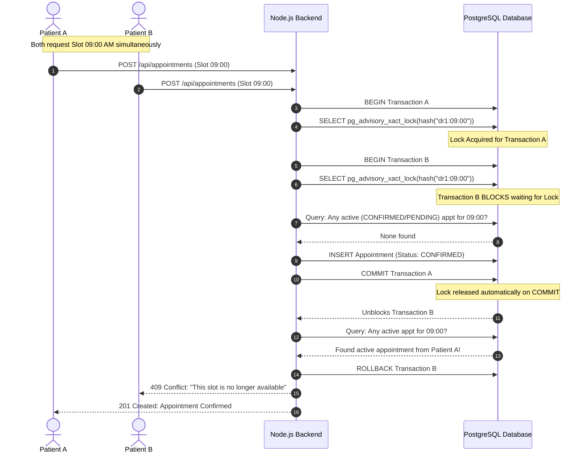
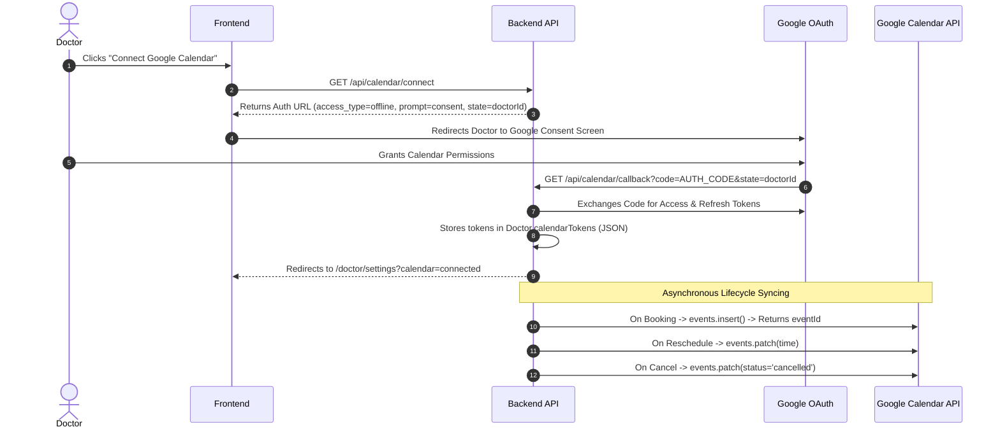

# System Design & Architecture Specification

## 1. Concurrency Control & Double-Booking Prevention

### The Double-Booking Challenge
In medical scheduling systems, two patients submitting booking requests for the exact same slot within milliseconds of each other will produce a race condition if handled via naive `SELECT -> INSERT` queries.

### Why Unique Database Constraints Alone Are Insufficient
A simple database constraint like `@@unique([doctorId, scheduledAt])` prevents duplicate entries, but introduces a major flaw: when an appointment is **cancelled**, the row remains in the database with `status = 'CANCELLED'` for audit purposes. A unique constraint on `(doctorId, scheduledAt)` would permanently prevent that slot from being rebooked by another patient.

### The Solution: Transactional Advisory Locks (`pg_advisory_xact_lock`)
We implement PostgreSQL transaction-scoped advisory locks combined with application-level availability queries:



### Deterministic Hash Function
The 64-bit integer lock key is derived using a 64-bit FNV-1a / DJB2 variant hash over `doctorId:ISO_TIMESTAMP`:

```javascript
function slotLockKey(doctorId, scheduledAt) {
  const str = `${doctorId}:${new Date(scheduledAt).toISOString()}`;
  let hash = 5381n;
  for (let i = 0; i < str.length; i++) {
    hash = ((hash << 5n) + hash + BigInt(str.charCodeAt(i))) & 0x7fffffffffffffffn;
  }
  return hash;
}
```

---

## 2. LLM State Machine & Non-Blocking Execution

### Design Goals
1. Fast booking response times (< 150ms).
2. Zero holding of database transaction locks during external OpenAI HTTP calls.
3. Resilience to API outages or missing API keys without failing business operations.

```
       [ Booking Committed / Symptoms Updated ]
                          │
                          ▼
            [ Status: preVisitLlmStatus = 'PENDING' ]
                          │
            ┌─────────────┴─────────────┐
            ▼                           ▼
    [ OpenAI Success ]          [ OpenAI Failure / Timeout / No Key ]
            │                           │
            ▼                           ▼
   preVisitSummary: { ... }     preVisitSummary: null
   preVisitLlmStatus: 'DONE'    preVisitLlmStatus: 'FAILED'
```

### Prompt Engineering: Pre-Visit Triage
```
Analyse these symptoms and return a JSON object with exactly these fields:
- "urgency": one of "Low", "Medium", or "High"
- "chiefComplaint": a one-sentence summary of the main problem
- "suggestedQuestions": an array of exactly 3 questions the doctor should ask

Respond with valid JSON only, no extra text.
Symptoms: <patient_symptoms>
```

---

## 3. Atomic Leave Management & Conflict Resolution

When an administrator registers a leave date for a doctor, any existing booked consultations on that date must be cancelled immediately:

```javascript
await prisma.$transaction(async (tx) => {
  // 1. Create leave entry (Unique constraint on doctorId_date prevents duplicate leave records)
  const leave = await tx.doctorLeave.create({
    data: { doctorId, date: leaveDate, reason },
  });

  // 2. Find all active appointments on this date
  const conflicting = await tx.appointment.findMany({
    where: {
      doctorId,
      scheduledAt: { gte: dayStart, lte: dayEnd },
      status: { in: ['PENDING', 'CONFIRMED'] },
    },
  });

  // 3. Mark all conflicting appointments as CANCELLED
  if (conflicting.length > 0) {
    await tx.appointment.updateMany({
      where: { id: { in: conflicting.map(a => a.id) } },
      data: { status: 'CANCELLED' },
    });

    // 4. Queue cancellation email notifications for all affected patients
    await tx.notificationLog.createMany({
      data: conflicting.map((a) => ({
        appointmentId: a.id,
        type: 'CANCELLATION',
        channel: 'EMAIL',
        status: 'PENDING',
      })),
    });
  }
});
```

---

## 4. Google Calendar OAuth 2.0 Lifecycle



---

## 5. Notification Processing & Retry Strategy

Notifications use the `NotificationLog` table to decouple operational triggers from third-party network calls:

- **State Transitions**: `PENDING` ➔ `SENT` | `FAILED`
- **Retry Mechanism**: A background worker runs every 5 minutes querying `WHERE status IN ('PENDING', 'FAILED') AND attempt < 3`.
- **Exponential Tracking**: Increments `attempt` count and stores error stack trace on failure.
